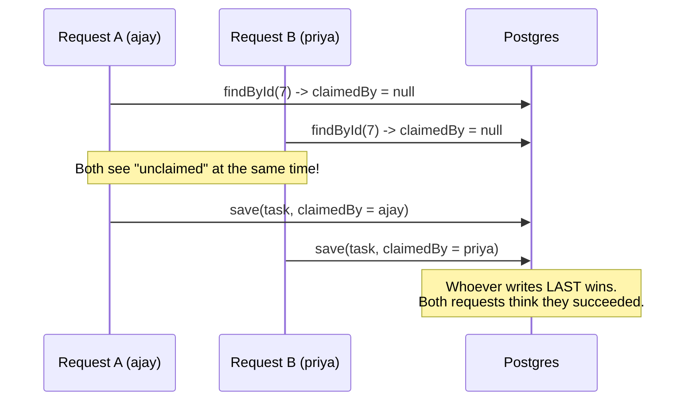
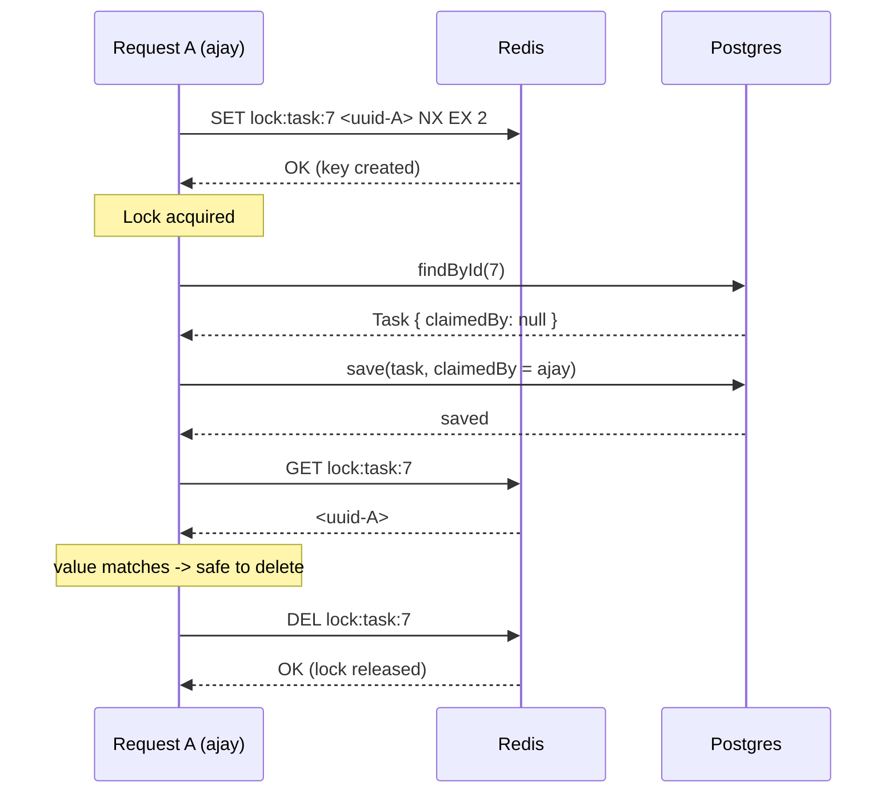
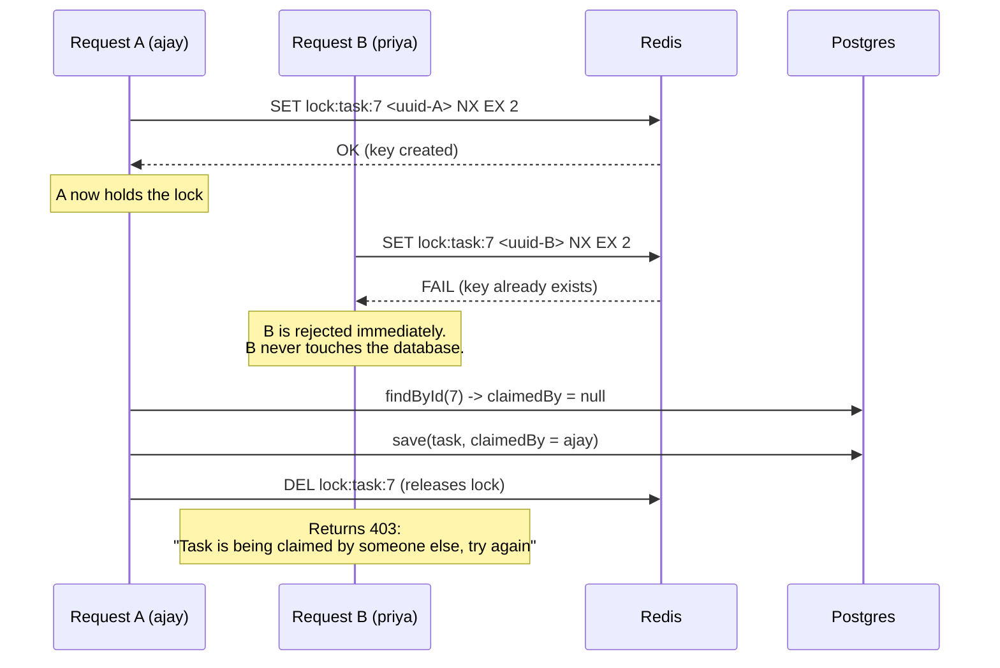
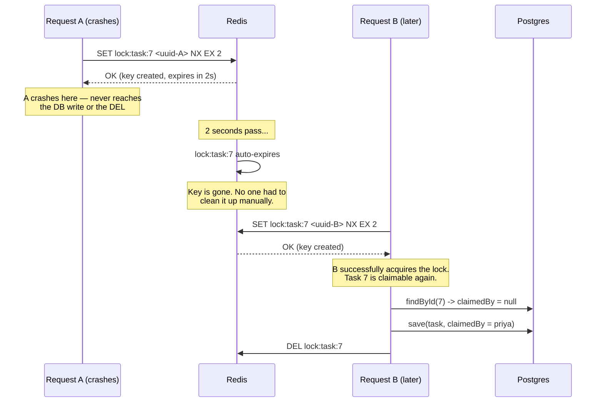
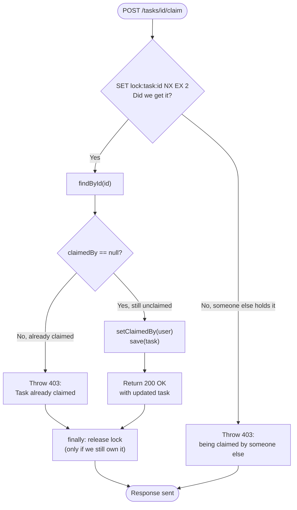

# Distributed Locking — Sequence Diagrams
### Teaching material: how `claimTask` uses Redis to prevent race conditions

---

## Why does `claimTask` even exist? (read this first)

Before looking at any code or diagrams — a simple question a student will
naturally ask: **"Why did we invent a whole new API just for this phase?
Doesn't the app already have create/read/update/delete?"**

Here's the plain-language answer.

**None of the existing APIs actually have a race condition to fix:**

- **createTask** — every request makes a *brand new* row. Two people
  creating a task at the same time never touch each other's data. Nothing
  to protect.
- **updateTask / deleteTask** — these only work on a task the logged-in
  user *already owns*. Since only the owner can act on their own task,
  two different users can never collide on the same row here. There's no
  scenario where two people are racing to update the *same* task at the
  *same* time.
- **getTaskById** — it's just a read. Reads don't cause race conditions.

So if we tried to teach "distributed locking" using only the existing
CRUD methods, there would be no actual bug to show — locking would look
pointless, because nothing is broken without it.

**That's why `claimTask` was invented — purely to create a real race
condition to learn from.** It's a shared, first-come-first-served
resource: *any* logged-in user can attempt to claim *any* unclaimed task.
That's the one scenario in this whole app where two different users can
legitimately race to write to the exact same row at the exact same
moment — which is the only situation where a distributed lock actually
matters.

**In short:** `claimTask` isn't a feature this task manager needed. It's a
deliberately manufactured example so Phase 5 would have something real to
break (Step 1) and then fix with Redis locking (Step 2–3). The lock
*pattern* you learn here is the reusable, transferable skill — you'd apply
the exact same technique anywhere a real app has a genuine "shared
resource, first writer wins" situation (claiming a support ticket,
grabbing a food-delivery order, reserving a seat, etc).

---

## Method Flow (plain text, before the diagrams)

Which method calls which, top to bottom — starting from the client:

```
CLIENT (Postman / frontend app)
    |
    | POST /tasks/7/claim
    | Header: Authorization: Bearer <JWT>
    v
Spring Security filter chain
    -> validates the JWT, extracts username
    -> sets Authentication in the security context
    |
    v
TaskController.claimTask(id, authentication)
    |
    v
TaskService.claimTask(id, username)
    |
    |-- 1. tryAcquireLock(lockKey, lockValue, ttl)
    |       -> redisTemplate.opsForValue().setIfAbsent(...)
    |       -> returns true (got it) or false (someone else has it)
    |
    |-- 2. if false: throw TaskAccessDeniedException, STOP HERE
    |
    |-- 3. if true, enter try block:
    |       taskRepository.findById(id)
    |       check task.getClaimedBy() == null
    |       task.setClaimedBy(user)
    |       taskRepository.save(task)
    |
    v
    finally: releaseLock(lockKey, lockValue)
            -> redisTemplate.opsForValue().get(lockKey)
            -> if it's still OUR value: redisTemplate.delete(lockKey)
```

The two things worth pointing out to a student here:
- **`tryAcquireLock` happens before any database call.** If it fails, we
  never touch Postgres at all — the lock is the gatekeeper.
- **`releaseLock` is in `finally`**, so it runs whether the claim succeeded,
  failed with "already claimed", or threw some unexpected error — the lock
  is never left behind on our own request's account.

---

## Diagram 1 — The Problem (no lock, two users claim at once)

This is what Phase 5, Step 1 demonstrated: two requests can both "win."



**Takeaway:** the bug isn't in the "check" or the "write" individually — it's
the *gap* between them. Nothing stops a second request from reading the old
state before the first request's write lands.

---

## Diagram 2 — The Fix (with lock, happy path)

This is one request, successfully claiming an unclaimed task, with locking
in place. No contention yet — just the normal flow.



**Key detail:** the `NX` in `SET ... NX EX 2` means "only set this key if it
does not already exist." That single Redis command does the check-and-set
atomically — there's no gap for another request to sneak into.

---

## Diagram 3 — The Fix Under Contention (two users, same task, locking active)

Now the real test: two requests hit the same unclaimed task at the same
moment, with locking in place.



**Takeaway:** Request B is stopped at the *lock*, before it ever reaches
the database. Only one request is ever inside the "read-check-write"
section at a time. This is the actual fix — compare to Diagram 1, where
both requests got all the way to the database.

---

## Diagram 4 — The Safety Net (what happens if a request crashes)

What if Request A acquires the lock, then crashes or hangs before it can
release it? This is why we set a TTL (2 seconds) on the lock.



**Takeaway:** without a TTL, a single crashed request would leave the lock
key in Redis forever — task 7 would be permanently un-claimable by anyone.
The TTL guarantees the system heals itself, even in the worst case.

---

## Diagram 5 — Decision logic inside `claimTask` (flowchart view)

A different angle on the same logic — useful for walking through the code
line by line.



**Note the two different "already claimed" style errors, and why they're
different:**
- **"Being claimed by someone else"** — you lost the race for the *lock
  itself*. Someone else is mid-claim right now.
- **"Task already claimed"** — you got the lock fine, but by the time you
  checked, someone had already finished claiming it earlier (lock had
  already been released, and the claim had gone through).

Both result in a 403, but they represent different moments in the timeline
— worth pointing this distinction out to a student, since it's a common
source of confusion ("why are there two different rejection messages for
what feels like the same thing?").
